# 🍽️ SplitTheBill

A real-time bill-splitting web app for groups — scan receipts, assign items, and settle up instantly.

**Stack:** React (Vite) · Spring Boot 3 (Java 21) · MySQL · Redis · WebSocket (STOMP) · Nginx · AWS EC2

---

## 📁 Project Structure

```
SplitTheBill/
├── backend/                  # Spring Boot REST API + WebSocket
│   ├── src/main/java/        # Java source (controllers, services, entities)
│   ├── src/main/resources/   # application.properties (dev + prod)
│   ├── Dockerfile
│   └── pom.xml
├── frontend/                 # React + Vite SPA
│   ├── src/                  # Components, pages, services, context
│   ├── public/
│   ├── index.html
│   ├── vite.config.js
│   └── package.json
├── deploy/
│   ├── setup-server.sh       # Run ONCE on a fresh EC2 instance
│   ├── deploy.sh             # Local → EC2 deploy script
│   └── .env.template         # Template for /opt/splitthebill/.env on EC2
└── .github/workflows/
    └── deploy.yml            # CI/CD: build + auto-deploy to EC2 on push to main
```

---

## 🏗️ System Architecture & Workflow

```mermaid
flowchart TD
    subgraph Client ["🌐 Client Layer (Browser)"]
        SPA["React 18 SPA (Vite)"]
        AuthCtx["Auth Context + Axios Interceptor"]
        WS_Client["STOMP WebSocket Client (SockJS)"]
    end

    subgraph EC2 ["☁️ AWS EC2 — Ubuntu 22.04"]
        subgraph Nginx ["🔀 Nginx Reverse Proxy (Port 80)"]
            Static["Serve Static Files\n/var/www/splitthebill"]
            ProxyAPI["Proxy /api/ → :8085"]
            ProxyWS["Proxy /ws/ → :8085 (Upgrade)"]
        end

        subgraph SpringBoot ["⚙️ Spring Boot 3 (Java 21) — Port 8085"]
            subgraph Security ["🔐 Security Layer"]
                JwtFilter["JWT Auth Filter"]
                SecConfig["Spring Security Config"]
            end

            subgraph Controllers ["📡 REST Controllers"]
                AuthCtrl["Auth Controller\n/api/auth/**"]
                SessionCtrl["Session Controller\n/api/sessions/**"]
                BillCtrl["Bill Controller\n/api/bills/**"]
                MemberCtrl["Member Controller\n/api/members/**"]
                SpinnerCtrl["Spinner Controller\n/api/spinner/**"]
            end

            subgraph WSLayer ["🔌 WebSocket Layer"]
                StompBroker["STOMP Message Broker"]
                WSConfig["WebSocket Config"]
            end

            subgraph Services ["🧠 Business Logic Services"]
                AuthSvc["Auth Service + JWT Util"]
                SessionSvc["Session Service + Timer Scheduler"]
                BillSvc["Bill Service + Split Calculator"]
                MemberSvc["Member Service"]
                SpinnerSvc["Spinner Service"]
                QrSvc["QR Code Service"]
                GeminiSvc["Gemini AI Service\n(Receipt OCR)"]
            end

            subgraph Repos ["🗄️ Spring Data JPA Repositories"]
                UserRepo["User Repository"]
                SessionRepo["Session Repository"]
                BillRepo["Bill Item Repository"]
                AssignRepo["Item Assignment Repository"]
                SpinnerRepo["Spinner Result Repository"]
            end
        end

        Redis["⚡ Redis (Port 6379)\nSession Cache + Pub/Sub"]
    end

    subgraph AWS ["☁️ AWS Cloud Services"]
        RDS["🗃️ Amazon RDS\nMySQL 8.x — hotelsplit_db"]
        S3["🪣 Amazon S3\nsplitthebill-pdfs\n(PDF Receipts)"]
    end

    subgraph External ["🌍 External APIs"]
        Gemini["🤖 Google Gemini AI\n(Bill Scan & Item Extraction)"]
        GoogleOAuth["🔑 Google OAuth 2.0"]
    end

    subgraph CICD ["🔄 CI/CD — GitHub Actions"]
        GHA["Push to main →\nBuild JAR + dist →\nSCP to EC2 →\nRestart service"]
    end

    %% Client → Nginx
    SPA -->|"HTTP REST /api/"| ProxyAPI
    WS_Client -->|"WebSocket /ws/"| ProxyWS
    Nginx --> Static

    %% Nginx → Spring Boot
    ProxyAPI --> JwtFilter
    ProxyWS --> StompBroker

    %% Security flow
    JwtFilter --> SecConfig
    SecConfig --> Controllers

    %% Controllers → Services
    AuthCtrl --> AuthSvc
    SessionCtrl --> SessionSvc
    BillCtrl --> BillSvc
    MemberCtrl --> MemberSvc
    SpinnerCtrl --> SpinnerSvc

    %% Services → Repos
    AuthSvc --> UserRepo
    SessionSvc --> SessionRepo
    BillSvc --> BillRepo
    BillSvc --> AssignRepo
    MemberSvc --> SessionRepo
    SpinnerSvc --> SpinnerRepo

    %% WebSocket broadcast
    Services --> StompBroker
    StompBroker -->|"STOMP push /topic/session/{id}"| WS_Client

    %% Repos → RDS
    UserRepo --> RDS
    SessionRepo --> RDS
    BillRepo --> RDS
    AssignRepo --> RDS
    SpinnerRepo --> RDS

    %% Services → Redis
    SessionSvc <-->|"Cache + Expiry"| Redis
    StompBroker <-->|"Pub/Sub"| Redis

    %% Services → AWS
    BillSvc -->|"Upload PDF"| S3
    GeminiSvc -->|"Gemini API"| Gemini

    %% Auth → Google
    AuthSvc -->|"Google Token Verify"| GoogleOAuth

    %% CI/CD
    CICD -->|"SCP JAR + dist"| EC2
```



### 🔑 Key Design Decisions

| Concern | Solution |
|---|---|
| **Real-time updates** | WebSocket (STOMP over SockJS) — all clients in a session get instant item assignments & payment status |
| **Session state** | Redis cache stores active session data with TTL-based expiry; MySQL is source of truth |
| **Auth** | Stateless JWT (HS512) — access token (24h) + refresh token (7d) |
| **Receipt scanning** | Google Gemini AI Vision parses bill photos → extracts line items automatically |
| **Reverse proxy** | Nginx serves the React SPA and proxies `/api/` & `/ws/` to Spring Boot on port 8085 |
| **PDF storage** | Receipts uploaded to Amazon S3 (`splitthebill-pdfs` bucket) |

---

## 🚀 AWS EC2 Deployment Guide

### Prerequisites

| What | Value |
|---|---|
| EC2 | Ubuntu 22.04 LTS, `t3.small` or larger |
| Ports open | 22 (SSH), 80 (HTTP), 443 (HTTPS optional) |
| RDS | MySQL 8.x (or MySQL on same EC2 for testing) |
| S3 bucket | `splitthebill-pdfs` in your region |

---

### Step 1 — First-time Server Setup (run once on EC2)

SSH into your fresh EC2 instance and run:

```bash
# Copy the setup script to EC2
scp -i your-key.pem deploy/setup-server.sh ubuntu@<EC2_IP>:~

# SSH in and run it
ssh -i your-key.pem ubuntu@<EC2_IP>
bash ~/setup-server.sh
```

This installs: **Java 21 · Nginx · Redis · Node.js 20** and configures the systemd service + Nginx reverse proxy.

---

### Step 2 — Configure Environment Variables on EC2

```bash
# SSH into EC2
ssh -i your-key.pem ubuntu@<EC2_IP>

# Create the env file from template
sudo nano /opt/splitthebill/.env
```

Fill in the values from [`deploy/.env.template`](deploy/.env.template):

```env
DB_HOST=<your-rds-endpoint>.rds.amazonaws.com
DB_USER=admin
DB_PASSWORD=YOUR_RDS_PASSWORD
JWT_SECRET=<generate with: openssl rand -base64 64>
FRONTEND_URL=http://<EC2_PUBLIC_IP>
AWS_ACCESS_KEY=...
AWS_SECRET_KEY=...
AWS_REGION=ap-south-1
GEMINI_API_KEY=...
SPRING_PROFILES_ACTIVE=prod
```

---

### Step 3 — Deploy the App (from your local machine)

Edit [`deploy/deploy.sh`](deploy/deploy.sh) and set your EC2 details:

```bash
EC2_USER="ubuntu"
EC2_HOST="<your-ec2-public-ip>"
EC2_KEY="/path/to/your-key.pem"
```

Then run:

```bash
bash deploy/deploy.sh
```

This will:
1. Build the React frontend (`npm run build`)
2. Build the Spring Boot JAR (`mvn clean package`)
3. SCP the JAR to `/opt/splitthebill/app.jar` on EC2
4. SCP the frontend `dist/` to `/var/www/splitthebill/`
5. Restart the `splitthebill` systemd service

---

### Step 4 — CI/CD Auto-Deploy (GitHub Actions)

On every push to `main`, the workflow in [`.github/workflows/deploy.yml`](.github/workflows/deploy.yml) will:
- Build backend JAR and frontend dist
- SCP both to your EC2
- Restart the service

**Add these GitHub Secrets** (`Settings → Secrets → Actions`):

| Secret | Value |
|---|---|
| `EC2_HOST` | Your EC2 public IP |
| `EC2_USER` | `ubuntu` |
| `EC2_SSH_KEY` | Contents of your `.pem` key file |
| `VITE_API_URL` | `http://<EC2_IP>/api` |
| `VITE_GOOGLE_CLIENT_ID` | Your Google OAuth Client ID |

---

### Step 5 — Verify Deployment

```bash
# Check service status
ssh -i your-key.pem ubuntu@<EC2_IP> 'sudo systemctl status splitthebill'

# Tail logs
ssh -i your-key.pem ubuntu@<EC2_IP> 'tail -f /var/log/splitthebill/app.log'

# Quick health check
curl http://<EC2_IP>/api/actuator/health
```

App should be live at: **`http://<EC2_IP>`**

---

## 💻 Local Development

### Backend

```bash
cd backend
# Set env vars or edit application.properties for local DB
mvn spring-boot:run
# Runs on http://localhost:8085
```

### Frontend

```bash
cd frontend
npm install
npm run dev
# Runs on http://localhost:5173
```

> The frontend uses `VITE_API_URL` from `.env.local` in dev mode.  
> Create `frontend/.env.local`:
> ```env
> VITE_API_URL=http://localhost:8085/api
> ```

---

## 🔑 Required Credentials

| Credential | Where to get |
|---|---|
| MySQL RDS | AWS RDS Console |
| JWT Secret | `openssl rand -base64 64` |
| AWS S3 keys | AWS IAM Console |
| Gemini API key | [aistudio.google.com/apikey](https://aistudio.google.com/apikey) |
| Google OAuth | [Google Cloud Console](https://console.cloud.google.com) |

---

## 📜 License

MIT License — see [LICENSE](LICENSE)
