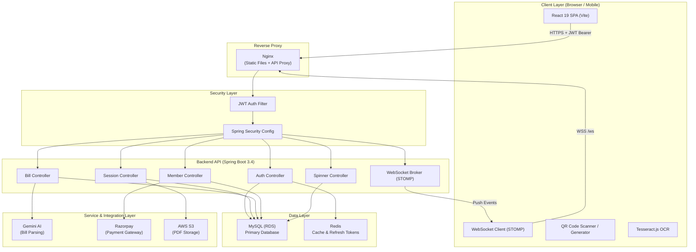
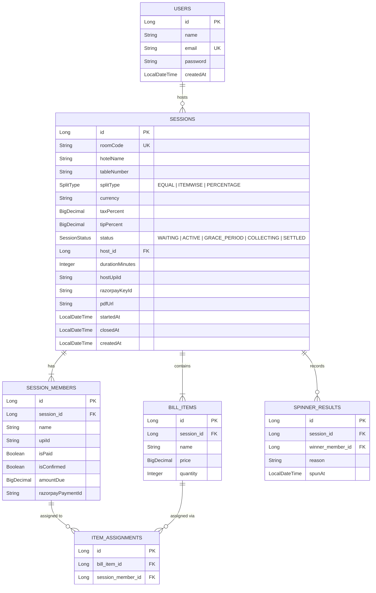
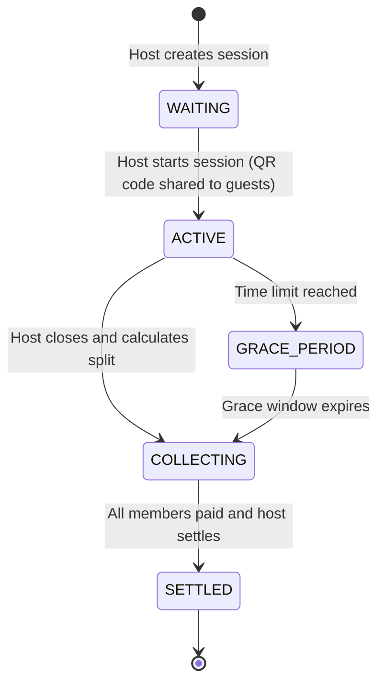

# 🍽️ SplitTheBill — Real-Time Hotel Bill Splitting Platform

> **Live Demo** → [https://nishath-splitthebill.duckdns.org](https://nishath-splitthebill.duckdns.org)

SplitTheBill is a full-stack, real-time bill splitting application built for groups dining out together. A host creates a session and shares a QR code — guests join instantly from their phones, items are added live, and everyone sees exactly what they owe. Pay via UPI or Razorpay and the host confirms payment right there at the table.

---

## 🌟 Key Features

- 📷 **AI-Powered Bill Scanning**: Upload a photo of your hotel bill — Gemini AI + Tesseract OCR extracts all line items automatically.
- 🔗 **QR Code Join Flow**: Guests scan a QR code to join the session instantly — no app install required.
- ⚡ **Real-Time WebSocket Sync**: Live updates of bill items, member statuses, and payment confirmations pushed to all connected devices.
- 💳 **Multiple Split Modes**: Split `EQUAL`, `ITEMWISE` (per-person item assignment), or `PERCENTAGE`.
- 💸 **Integrated Payments**: Pay via UPI deep-link (any UPI app) or Razorpay payment gateway — host confirms receipt in-app.
- 🎰 **Spinner — Who Pays Extra?**: A fun random spinner wheel to decide who covers taxes, tips, or extra charges.
- 📄 **PDF Bill Export**: Auto-generate an itemized bill PDF, upload to AWS S3, and share a link with the group.
- 🔐 **JWT Authentication**: Stateless, secure host authentication with access & refresh token support.
- 📊 **Session Dashboard**: Hosts see a full summary — members, amounts owed, and payment status at a glance.

---

## 🛠️ Tech Stack

### **Frontend**
| Technology | Purpose |
| :--- | :--- |
| **React 19** (Vite) | SPA framework & build tool |
| **React Router DOM v7** | Client-side routing |
| **Axios** | HTTP client with JWT interceptors |
| **WebSocket (STOMP)** | Real-time session push events |
| **QRCode.react** | QR code generation for room sharing |
| **jsQR + Tesseract.js** | In-browser QR scanning & OCR for bill photos |
| **React Toastify** | Notification toasts |
| **Bootstrap 5** | UI component styling |

### **Backend**
| Technology | Purpose |
| :--- | :--- |
| **Java 21 (LTS)** | Language & runtime |
| **Spring Boot 3.4.0** | Application framework |
| **Spring Security + JJWT** | JWT-based authentication & authorization |
| **Spring Data JPA + Hibernate** | ORM & database access layer |
| **Spring WebSocket (STOMP)** | Real-time push events to clients |
| **Spring Data Redis** | Session caching & refresh token storage |
| **MySQL 8** | Relational database |
| **iText 7 (PDF)** | Itemized bill PDF generation |
| **AWS SDK S3** | PDF upload & cloud storage |
| **Google ZXing** | QR code image generation |
| **Google Gemini AI** | AI-powered bill item extraction from images |
| **Apache Maven** | Build & dependency management |

### **Infrastructure**
| Component | Technology |
| :--- | :--- |
| **Cloud** | AWS EC2 (Ubuntu) |
| **Database** | AWS RDS (MySQL 8) |
| **File Storage** | AWS S3 |
| **Cache** | Redis |
| **Reverse Proxy** | Nginx |
| **Process Manager** | systemd |

---

## 🏗️ System Architecture



---

## 📊 Database Entity-Relationship (ER) Diagram



---

## 🔄 Session Lifecycle



---

## ⚡ Quick Start & Installation

### Prerequisites
- **Java 21** (LTS)
- **Node.js 18+** & npm
- **MySQL 8+** (running locally)
- **Redis** (running locally on port `6379`)
- **Maven 3.9+**

---

### 🚀 One-Click Launch (Windows)

Double-click **`run.bat`** or run from a terminal:

```cmd
run.bat
```

This automatically detects Java 21 and Maven, then starts the backend and frontend in separate terminal windows.

| Service | URL |
| :--- | :--- |
| **Frontend** | `http://localhost:5173` |
| **Backend API** | `http://localhost:8085` |

---

### 🔧 Manual Setup

#### **1. Create the Database**
```sql
CREATE DATABASE hotelsplit_db;
```

#### **2. Configure Backend**

Edit `backend/src/main/resources/application.properties`:
```properties
spring.datasource.username=root
spring.datasource.password=YOUR_MYSQL_PASSWORD
```

#### **3. Add Gemini AI API Key (for bill scanning)**

Get a free key at [https://aistudio.google.com/apikey](https://aistudio.google.com/apikey):
```properties
app.gemini.api-key=YOUR_GEMINI_API_KEY_HERE
```

#### **4. Start Redis**
```bash
# Linux/Mac
redis-server

# Windows (via Docker)
docker run -d -p 6379:6379 redis:alpine
```

#### **5. Run Backend**
```bash
cd backend
./mvnw spring-boot:run
```
*Backend starts on `http://localhost:8085`*

#### **6. Run Frontend**
```bash
cd frontend
npm install
npm run dev
```
*Frontend starts on `http://localhost:5173`*

---

## ☁️ Production Deployment (AWS EC2 + RDS)

### 1. Configure environment variables on EC2

Copy `deploy/.env.template` to `/opt/splitthebill/.env` on your EC2 instance:

```env
DB_HOST=your-rds-endpoint.rds.amazonaws.com
DB_USER=admin
DB_PASSWORD=YOUR_DB_PASSWORD
JWT_SECRET=your-long-random-secret-min-64-chars
FRONTEND_URL=https://your-domain.com
AWS_ACCESS_KEY=YOUR_KEY
AWS_SECRET_KEY=YOUR_SECRET
SPRING_PROFILES_ACTIVE=prod
```

### 2. First-time server setup
```bash
bash setup-server.sh
```

### 3. Deploy with one command (from your local machine)
```bash
bash deploy.sh
```

This script:
1. Builds the React frontend (`npm run build`)
2. Packages the Spring Boot JAR (`mvn clean package`)
3. Uploads files to EC2 via SCP
4. Restarts the `splitthebill` systemd service

---

## 📡 REST API Reference

### 🔑 Authentication
| Method | Endpoint | Auth | Description |
| :--- | :--- | :--- | :--- |
| `POST` | `/api/auth/register` | ❌ | Register a new host account |
| `POST` | `/api/auth/login` | ❌ | Login and receive JWT tokens |
| `POST` | `/api/auth/refresh` | ❌ | Refresh an expired access token |

### 🪑 Sessions
| Method | Endpoint | Auth | Description |
| :--- | :--- | :--- | :--- |
| `POST` | `/api/sessions` | ✅ JWT | Create a new split session |
| `GET` | `/api/sessions/my` | ✅ JWT | List all sessions for logged-in host |
| `GET` | `/api/sessions/{roomCode}` | ❌ | Get session details (+ optional QR) |
| `POST` | `/api/sessions/{roomCode}/start` | ✅ Host | Open session — share QR to guests |
| `POST` | `/api/sessions/{roomCode}/close` | ✅ Host | Close joining, begin grace period |
| `POST` | `/api/sessions/{roomCode}/calculate` | ✅ Host | Calculate and distribute amounts |
| `PATCH` | `/api/sessions/{roomCode}/tax-tip` | ✅ Host | Update tax & tip percentages |
| `POST` | `/api/sessions/{roomCode}/settle` | ✅ Host | Mark session as fully settled |

### 🧾 Bill Items
| Method | Endpoint | Auth | Description |
| :--- | :--- | :--- | :--- |
| `POST` | `/api/sessions/{roomCode}/items` | ❌ | Add a bill item manually |
| `GET` | `/api/sessions/{roomCode}/items` | ❌ | List all items in session |
| `DELETE` | `/api/sessions/{roomCode}/items/{itemId}` | ✅ Host | Remove a bill item |
| `POST` | `/api/sessions/{roomCode}/items/scan-bill` | ❌ | Scan bill image via Gemini AI |
| `POST` | `/api/sessions/{roomCode}/items/parse-text` | ❌ | Parse raw OCR text with Gemini |

### 👥 Members
| Method | Endpoint | Auth | Description |
| :--- | :--- | :--- | :--- |
| `POST` | `/api/sessions/{roomCode}/join` | ❌ | Guest joins a session |
| `GET` | `/api/sessions/{roomCode}/members` | ❌ | List all members in session |
| `POST` | `/api/members/{memberId}/mark-paid` | ❌ | Guest marks themselves as paid (UPI) |
| `POST` | `/api/members/{memberId}/confirm-razorpay` | ❌ | Confirm Razorpay payment |
| `POST` | `/api/members/{memberId}/confirm` | ✅ Host | Host confirms a payment |
| `POST` | `/api/members/{memberId}/reject` | ✅ Host | Host rejects a payment claim |

### 🎰 Spinner
| Method | Endpoint | Auth | Description |
| :--- | :--- | :--- | :--- |
| `POST` | `/api/sessions/{roomCode}/spin` | ✅ Host | Spin the wheel to pick a random member |
| `GET` | `/api/sessions/{roomCode}/spin/history` | ❌ | Get previous spin results |

---

## 🗂️ Project Structure

```
SplitTheBill/
├── backend/                          # Spring Boot backend
│   ├── src/main/java/com/hotelsplit/
│   │   ├── controller/               # REST API controllers
│   │   ├── service/                  # Business logic
│   │   ├── entity/                   # JPA entities (Session, Member, BillItem...)
│   │   ├── dto/                      # Request / Response DTOs
│   │   ├── repository/               # Spring Data JPA repositories
│   │   ├── security/                 # JWT filter & Spring Security config
│   │   └── config/                   # WebSocket, CORS, AWS S3, Redis config
│   ├── src/main/resources/
│   │   ├── application.properties    # Local config
│   │   └── application-prod.properties  # Production config
│   ├── pom.xml
│   └── Dockerfile
│
├── frontend/                         # React 19 + Vite frontend
│   ├── src/
│   │   ├── pages/                    # Route-level page components
│   │   ├── components/               # Reusable UI components
│   │   ├── context/                  # React Auth context
│   │   ├── services/                 # Axios API service layer
│   │   └── utils/                    # Utility helpers
│   ├── package.json
│   └── vite.config.js
│
├── deploy/
│   └── .env.template                 # Production environment variables template
├── deploy.sh                         # One-command EC2 deployment script
├── run.bat                           # One-click Windows local launcher
└── setup-server.sh                   # EC2 first-time server provisioning script
```

---

## 🔐 Environment Variables

| Variable | Description | Required |
| :--- | :--- | :--- |
| `DB_HOST` | MySQL / RDS hostname | Production |
| `DB_USER` | Database username | Production |
| `DB_PASSWORD` | Database password | Always |
| `JWT_SECRET` | Secret key for signing JWTs (min 64 chars) | Always |
| `FRONTEND_URL` | Allowed CORS origin | Always |
| `AWS_ACCESS_KEY` | AWS access key for S3 PDF uploads | For PDF export |
| `AWS_SECRET_KEY` | AWS secret key for S3 | For PDF export |
| `app.gemini.api-key` | Google Gemini API key for AI bill scanning | For bill scan |

---

## 📜 License

This project is licensed under the [MIT License](LICENSE).

---

*Built with ❤️ — Java 21 + Spring Boot 3.4 + React 19*
